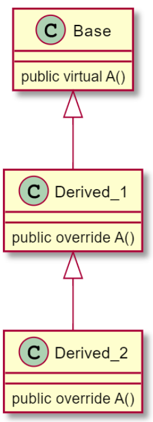

# Lab 11 Exercise 4

## Virtual member inheritance


1.สร้าง console application project

```cmd
dotnet new console --name Lab11_Ex04
```


2.เปลี่ยน code ให้เป็นดังต่อไปนี้

```cs
var b = new Base();
var d1 = new Derived_1();
var d2 = new Derived_2();

b.A();
d1.A();
d2.A();

class Base
{
    public virtual void A()
    {
        System.Console.WriteLine("Base.A()");
    }
}
class Derived_1 : Base
{
    public override void A()
    {
        System.Console.WriteLine("Derived_1.A()");
    }
}
class Derived_2 : Derived_1
{
    public override void A()
    {
        System.Console.WriteLine("Derived_2.A()");
    }
}
```


3.Build project โดยการใช้คำสั่ง

```cmd
dotnet build  Lab11_Ex04
```

ถ้ามีที่ผิดพลาดในโปรแกรม ให้แก้ไขให้ถูกต้อง

4.บันทึกผลที่ได้จากการรันคำสั่งในข้อ 3


5.Run project โดยการใช้คำสั่ง

```cmd
dotnet run --project Lab11_Ex04
```

6.บันทึกผลที่ได้จากการรันคำสั่งในข้อ 5


7.อธิบายสิ่งที่พบในการทดลอง

จากการทดลองดังกล่าวเป็นการสร้างคลาสและอ็อบเจกต์เพื่อทดสอบการทำงานของการโอเวอร์ไรด์เมทอดใน C# โดยมีโครงสร้างดังนี้
สร้างคลาส Base ซึ่งมีเมทอด A() เป็นเมทอดเสมือน virtual ซึ่งหมายความว่าเมทอดนี้สามารถถูกโอเวอร์ไรด์ได้ในคลาสลูก

สร้างคลาส Derived_1 ที่สืบทอดมาจาก Base โดยมีการโอเวอร์ไรด์เมทอด A() เพื่อแสดงข้อความ "Derived_1.A()"

สร้างคลาส Derived_2 ที่สืบทอดมาจาก Derived_1 โดยมีการโอเวอร์ไรด์เมทอด A() เพื่อแสดงข้อความ "Derived_2.A()"

เมื่อสร้างอ็อบเจกต์ b จากคลาส Base, d1 จากคลาส Derived_1, และ d2 จากคลาส Derived_2 และเรียกใช้เมทอด A() บนแต่ละอ็อบเจกต์ ผลลัพธ์ที่คาดหวังจะมีการแสดงข้อความตามลำดับต่อไปนี้

เมื่อเรียกใช้ A() บนอ็อบเจกต์ b (จากคลาส Base) จะแสดงข้อความ "Base.A()" เนื่องจากเมทอด A() ไม่ถูกโอเวอร์ไรด์ในคลาสลูก
เมื่อเรียกใช้ A() บนอ็อบเจกต์ d1 (จากคลาส Derived_1) จะแสดงข้อความ "Derived_1.A()" เนื่องจากคลาส Derived_1 ได้โอเวอร์ไรด์เมทอด A()
เมื่อเรียกใช้ A() บนอ็อบเจกต์ d2 (จากคลาส Derived_2) จะแสดงข้อความ "Derived_2.A()" เนื่องจากคลาส Derived_2 ได้โอเวอร์ไรด์เมทอด A() ซึ่งเป็นการโอเวอร์ไรด์ของเมทอด A() ในคลาส Derived_1 ที่โดยลำดับอยู่ข้างหน้า ณ เวลาเรียกใช้งาน

ดังนั้นผลลัพธ์ดังนี้

Base.A()

Derived_1.A()

Derived_2.A()

ซึ่งจะแสดงลำดับการเรียกใช้งานของเมทอด A()

เราจะเห็นผลลัพธ์ดังด้านบน
