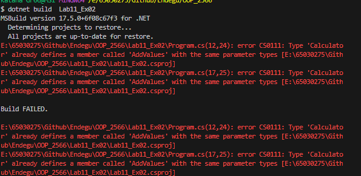
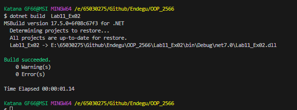
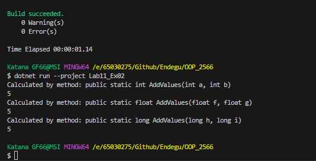

System.Console.WriteLine(Calculator.AddValues(2, 3));
System.Console.WriteLine(Calculator.AddValues(2.0f, 3.0f));
System.Console.WriteLine(Calculator.AddValues(2L, 3L));

public static class Calculator
{
    public static int AddValues(int a, int b)
    {
        System.Console.WriteLine("Calculated by method: public static int AddValues(int a, int b)");
        return a + b;
    }
    public static float AddValues(float f, float g)
    {
        System.Console.WriteLine("Calculated by method: public static float AddValues(float f, float g)");
        return f + g;
    }
    public static long AddValues(long h, long i)
    {
        System.Console.WriteLine("Calculated by method: public static long AddValues(long h, long i)");
        return h + i;
    }
}

การเรียกใช้เมท็อดของ Calculator จะแสดงผลลัพธ์ของการคำนวณพร้อมกับข้อความที่ระบุในเมท็อดที่ถูกเรียกใช้งาน

