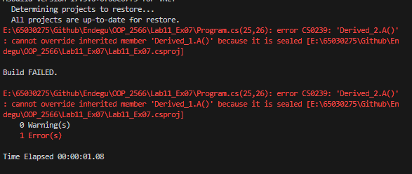
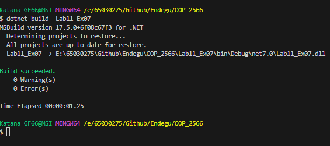
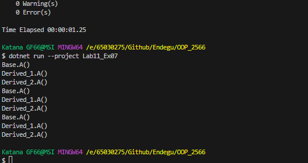

Derived_2 d2 = new Derived_2();
Base b = (Base) d2;
Derived_1 d1 = (Derived_1) d2;

b.A();  // ผลลัพธ์: Derived_1.A()
d1.A(); // ผลลัพธ์: Derived_1.A()
d2.A(); // ผลลัพธ์: Derived_2.A()

class Base
{
    public virtual void A()
    {
        System.Console.WriteLine("Base.A()");
    }
}

class Derived_1 : Base
{
    public override void A() // ลบ sealed keyword ออก
    {
        base.A();
        System.Console.WriteLine("Derived_1.A()");
    }
}

class Derived_2 : Derived_1
{
    public override void A()
    {
        base.A();
        System.Console.WriteLine("Derived_2.A()");
    }
}

